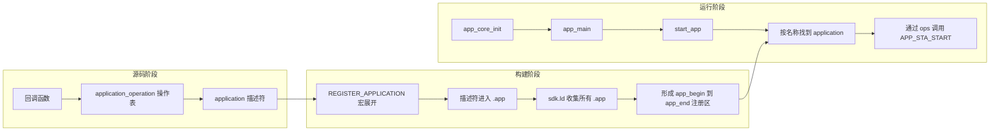

# 杰理 AC79 应用启动与注册机制详解：从 `REGISTER_APPLICATION` 到 `start_app`

第一次看杰理 SDK 的应用代码时，很容易产生一个疑问：代码中没有常见的 `register_app(&app)`，系统为什么仍然知道有哪些应用，又怎样找到指定应用并调用我们的代码？

答案是：杰理使用了一套**链接期静态注册**机制。开发者在源码中定义应用描述符，编译器把描述符放进特殊段，链接器把所有描述符收集成注册区；设备启动后，`app_core` 再从注册区找到目标应用，通过函数指针进入应用回调。

本文只讲清这个“应用外壳”如何被注册和启动，主线止于 `APP_STA_START`。启动后眼睛、摇一摇等模块怎样工作，以及按键和摇一摇怎样通过事件驱动业务，分别放在后两篇中。

## 系列阅读顺序

1. **本文**：杰理平台怎样注册并启动 `paipop_toy` 应用。
2. [paipopAi 对话玩具解析（一）：从 `APP_STA_START` 到眼睛任务与摇一摇服务](/posts/paipopai对话玩具解析一从应用启动到眼睛与摇一摇/)：进入 `APP_STA_START` 后，玩具层怎样初始化眼睛、STK8321 和摇一摇服务。
3. [paipopAi 对话玩具解析（二）：从按键与摇一摇到对话打断](/posts/paipopai对话玩具解析二从按键与摇一摇到对话打断/)：回调、杰理系统事件和 Paipop 业务 FSM 怎样配合。

> 本文基于 AC79NN SDK V1.2.5 中的 Paipop 玩具工程。`start_app()` 的公开声明能够看到，但实现位于杰理预编译库中。因此下文会区分“源码直接确认”和“由链接、符号证据强力支持”的结论，不把等价伪代码冒充成杰理源码。

## 一、先用一张图建立完整主线

杰理应用启动可以按发生时间分成三个阶段：

- **源码阶段**：开发者写回调、操作表和应用描述符；
- **构建阶段**：预处理器展开宏，编译器生成 `.app`，链接器形成应用注册区；
- **运行阶段**：系统初始化 `app_core`，`app_main()` 通过 `start_app()` 选择应用，框架再调用状态机回调。



理解这张图之后，后面的宏、特殊段、链接脚本和函数指针就不再是互相割裂的知识点，而是同一条链路中的不同环节。

## 二、源码阶段：把应用描述清楚

### 1. 先分清代码归属

| 代码 | 归属 | 在启动链路中的作用 |
|---|---|---|
| `apps/Paipop_YP_Toy/app_main.c` 中的回调、操作表、应用描述符和 `app_main()` | Paipop 第一方代码 | 定义应用叫什么、启动后做什么 |
| `include_lib/system/app_core.h` 中的结构体、状态枚举、宏和接口声明 | 杰理 SDK | 规定应用接入框架时必须遵守的契约 |
| `apps/common/system/init.c`、`cpu/wl82/sdk_ld.c` 及生成的 `sdk.ld` | 杰理 SDK 公共框架 | 完成系统初始化和链接期收集 |
| `cpu/wl82/liba/system.a(app_core.c.o)` | 杰理预编译库 | 提供 `app_core_init()`、`start_app()` 等运行时实现 |

所以，**注册机制由杰理提供，注册进去的 Paipop 应用描述和回调实现由项目自己提供**。`PaipopSDK` 的语音与对话能力是在应用启动之后才被业务层使用的，不负责创建 `.app` 注册机制。

### 2. 两个回调是应用留给框架的入口

Paipop 工程在 `app_main.c` 中定义了两个入口函数。下面只保留与本文有关的骨架：

```c
static int paipop_toy_state_machine(struct application *app,
                                    enum app_state state,
                                    struct intent *it)
{
    switch (state) {
    case APP_STA_START:
        paipop_eye_service_init();
        paipop_fsm_init();
        /* 初始化 OTA、事件、摇一摇、网络等业务模块 */
        paipop_fsm_dispatch(PAIPOP_EVT_APP_START, 0);
        break;

    case APP_STA_STOP:
    case APP_STA_DESTROY:
        /* 按相反顺序停止并释放业务模块 */
        break;

    default:
        break;
    }

    return 0;
}

static int paipop_toy_event_handler(struct application *app,
                                    struct sys_event *event)
{
    if (!event) {
        return false;
    }

    return paipop_events_handle_sys_event(event);
}
```

两者的边界是：

- `paipop_toy_state_machine()` 处理应用创建、启动、停止、销毁等**生命周期变化**；
- `paipop_toy_event_handler()` 是应用运行期间接收系统事件的统一入口。

本文重点是前者怎样被注册和触发。事件进入应用后怎样分类，留到系列（二）再展开。

这里的 `static` 只限制函数名在当前 C 翻译单元中的可见范围。函数地址被操作表保存后，框架仍然可以通过函数指针调用它。

### 3. 操作表保存回调地址

杰理在 `app_core.h` 中规定了操作表的形状：

```c
struct application_operation {
    int (*state_machine)(struct application *,
                         enum app_state,
                         struct intent *);
    int (*event_handler)(struct application *,
                         struct sys_event *);
};
```

Paipop 再把两个函数地址填入这张表：

```c
static const struct application_operation paipop_toy_ops = {
    .state_machine = paipop_toy_state_machine,
    .event_handler = paipop_toy_event_handler,
};
```

`paipop_toy_ops` 可以理解为应用交给杰理框架的一张“操作说明”：生命周期变化时调用 `state_machine`，收到日常系统事件时调用 `event_handler`。框架不需要知道 Paipop 内部有哪些眼睛、Wi-Fi、OTA 或语音模块，只需要遵守这张接口表。

### 4. 应用描述符把名称、状态和操作表绑在一起

杰理的应用描述符定义如下：

```c
struct application {
    u8 state;
    int action;
    char *data;
    const char *name;
    struct list_head entry;
    void *private_data;
    const struct application_operation *ops;
};
```

其中最关键的是：

- `name`：应用的运行时名称，`start_app()` 用它选择目标；
- `ops`：指向刚才的操作表；
- `state`：记录应用生命周期状态。

Paipop 用下面的代码把三者绑定：

```c
REGISTER_APPLICATION(paipop_toy) = {
    .name = "paipop_toy",
    .ops = &paipop_toy_ops,
    .state = APP_STA_DESTROY,
};
```

到这里，源码已经回答了两个问题：这个应用叫 `"paipop_toy"`，找到它以后应该通过 `paipop_toy_ops` 调用哪些入口。

## 三、构建阶段：把分散的描述符收集成注册区

### 1. `REGISTER_APPLICATION` 不是运行时函数

宏定义是：

```c
#define REGISTER_APPLICATION(at) \
    static struct application at SEC_USED(.app)
```

`SEC_USED` 又定义为：

```c
#define SEC_USED(x) __attribute__((section(#x), used))
```

因此，Paipop 的注册代码经过预处理后，核心效果等价于：

```c
static struct application paipop_toy
    __attribute__((section(".app"), used)) = {
        .name = "paipop_toy",
        .ops = &paipop_toy_ops,
        .state = APP_STA_DESTROY,
    };
```

这里发生了三件事：

1. 宏形参 `at` 被替换为变量名 `paipop_toy`；
2. `#x` 把 `.app` 字符串化为 `".app"`；
3. `section(".app")` 要求编译器把描述符放入 `.app` 输入段，`used` 则要求编译器保留它。

注意区分两个名称：

```c
paipop_toy       // C 变量标识符
"paipop_toy"     // 运行时用于匹配应用的字符串
```

它们写成相同内容便于阅读，但真正参与运行时名称匹配的是 `.name` 指向的字符串。

### 2. `.app` 中不是整个应用代码

`.app` 只保存 `struct application` 描述符。应用相关内容大致分布为：

- 回调函数的机器指令位于代码段；
- `"paipop_toy"` 和只读操作表通常位于只读数据区域；
- `.app` 保存描述符，其中的 `name`、`ops` 指针再指向前两者。

因此，应用描述符更像一张索引卡，而不是应用代码本身。链接器只需要集中收集这些尺寸固定、结构统一的索引卡，运行时框架就能依次检查它们。

`used` 也不是全部保障：它主要防止编译器删除对象，最终仍然需要链接脚本主动收集 `.app` 段。

### 3. 链接脚本形成 `app_begin` 到 `app_end`

`cpu/wl82/sdk.ld` 中的关键规则是：

```text
_app_begin = .;
PROVIDE(app_begin = .);
*(.app)
_app_end = .;
PROVIDE(app_end = .);
```

这里的 `.` 是链接器的位置计数器。这段规则按顺序完成：

1. 在收集应用前记录 `app_begin`；
2. 用 `*(.app)` 收集所有输入目标文件中的 `.app`；
3. 收集完成后记录 `app_end`。

最终形成一个左闭右开的注册区 `[app_begin, app_end)`。`app_begin` 和 `app_end` 是链接器定义的边界符号，不是某个 C 文件中定义的普通 `struct application` 变量。

本次 Paipop 构建保存的 `sdk.map` 中可以看到：

```text
0x04007bac  _app_begin = .
0x04007bac  PROVIDE (app_begin, .)
            *(.app)
0x04007bac  .app  size 0x20  sdk.elf.o
0x04007bcc  _app_end = .
0x04007bcc  PROVIDE (app_end, .)
```

这次构建的注册区长度是 `0x20`，即 32 字节，对应当前构建中的一个应用描述符。地址和尺寸只是本次构建结果，应用数量、配置或工具链变化后都可能改变，业务代码不应把它们写死。

### 4. `sdk.ld` 的机制来自 SDK，文件由当前配置生成

Paipop 的 `board/wl82/Makefile` 会预处理杰理提供的 `cpu/wl82/sdk_ld.c`：

```make
$(CC) $(CFLAGS) $(DEFINES) $(INCLUDES) \
    -D__LD__ -E -P ../../../../cpu/wl82/sdk_ld.c \
    -o ../../../../cpu/wl82/sdk.ld
```

所以准确说法是：**杰理 SDK 提供链接脚本模板和生成规则，构建系统根据当前宏配置生成 `sdk.ld`，链接器再通过它完成最终布局。**

## 四、运行阶段：`app_core` 怎样找到并启动 Paipop

### 1. 先初始化框架，再进入应用入口

杰理公共代码 `apps/common/system/init.c` 中，`app_task_handler()` 的关键顺序如下：

```c
sys_timer_init();
sys_timer_task_init();

board_early_init();
__do_initcall(early_initcall);
__do_initcall(platform_initcall);
board_init();

__do_initcall(initcall);
__do_initcall(module_initcall);
app_core_init();
__do_initcall(late_initcall);
app_main();

while (1) {
    res = os_task_pend("taskq", msg, ARRAY_SIZE(msg));
    if (res == OS_TASKQ) {
        app_core_msg_handler(msg);
    }
}
```

最关键的先后关系是：

```text
app_core_init() → app_main() → app_core 消息循环
```

也就是说，Paipop 请求启动应用之前，杰理的应用核心已经完成初始化。

### 2. `app_main()` 用 `intent` 指定目标应用

Paipop 的入口代码很短：

```c
void app_main(void)
{
    struct intent it;

    puts("------------- Paipop YP Toy app -------------\n");
    init_intent(&it);
    it.name = "paipop_toy";
    start_app(&it);
}
```

`struct intent` 表示一次应用启动请求：

```c
struct intent {
    const char *name;
    int action;
    const char *data;
    u32 exdata;
};
```

Paipop 这里只填写 `name`，因此可以读成：“请启动名为 `paipop_toy` 的应用。”

### 3. `start_app()` 怎样匹配应用

从公开头文件和链接结果可以直接确认：

- `start_app(struct intent *it)` 是杰理 `app_core` 的接口；
- 链接脚本提供 `app_begin` 和 `app_end`；
- Paipop 描述符位于这两个边界之间；
- 启动请求和描述符中的名称都是 `"paipop_toy"`；
- 描述符的 `ops` 指向 `paipop_toy_ops`。

`start_app()` 的 C 实现位于杰理预编译的 `system.a(app_core.c.o)` 中。该目标模块的符号表包含：

```text
t __start_app
U app_begin
W app_core_init
U app_end
T start_app
U strcmp
```

这组证据强力支持“遍历 `[app_begin, app_end)`，通过字符串比较选择应用”的判断。下面只能写成帮助理解的等价伪代码：

```c
static struct application *match_application(const char *name)
{
    for (struct application *app = app_begin;
         app < app_end;
         app++) {
        if (strcmp(app->name, name) == 0) {
            return app;
        }
    }

    return NULL;
}
```

匹配成功后，框架再通过操作表间接调用应用生命周期入口，概念上类似：

```c
app->ops->state_machine(app, APP_STA_START, it);
```

由于真实实现没有开放源码，不能仅凭符号表断言其全部分支和每一个中间状态。可以确认的是：Paipop 正常启动最终会进入 `APP_STA_START` 分支，否则其中的眼睛、事件、摇一摇和网络等业务模块不会开始初始化。

### 4. `APP_STA_*` 管应用外壳，不等于 Paipop 业务状态

杰理定义的生命周期状态包括：

```c
enum app_state {
    APP_STA_CREATE,
    APP_STA_START,
    APP_STA_PAUSE,
    APP_STA_RESUME,
    APP_STA_STOP,
    APP_STA_DESTROY,
};
```

这些状态回答的是：“整个 Paipop 应用有没有启动、暂停、停止或销毁？”

Paipop 自己还有一套业务 FSM，用来回答：“玩具正在配网、初始化、对话还是退出？”这套内部状态不是 `app_core` 直接管理的。两层的连接点位于 `APP_STA_START`：杰理框架启动应用后，Paipop 才初始化并启动自己的业务层。

这篇文章到这里就完成了任务。再往下追眼睛和摇一摇服务，请看系列（一）；追按键、系统事件和业务 FSM，请看系列（二）。

## 五、哪些代码自己写，哪些步骤自动完成

下面这张表把开发者、构建工具和运行时框架的职责一次分清：

| 步骤 | 谁负责 | 发生阶段 |
|---|---|---|
| 实现状态机与事件回调 | Paipop 开发者 | 源码阶段 |
| 填写 `application_operation` | Paipop 开发者 | 源码阶段 |
| 写 `REGISTER_APPLICATION(...)` 描述符 | Paipop 开发者 | 源码阶段 |
| 展开宏、替换形参、字符串化 `.app` | C 预处理器 | 构建阶段 |
| 生成 `.app` 和所需重定位信息 | 编译器/LTO 工具链 | 构建阶段 |
| 用 `sdk.ld` 收集 `.app`，形成边界 | 链接器 | 构建阶段 |
| 在 `app_main()` 填写目标应用名 | Paipop 开发者 | 运行阶段对应的业务代码 |
| 初始化 `app_core`、匹配应用、调度回调 | 杰理框架 | 运行阶段 |
| 初始化眼睛、摇一摇、网络和业务 FSM | Paipop 回调中的代码 | 框架触发 `APP_STA_START` 后 |

因此，宏展开和段收集确实会自动完成，但它们发生在构建固件时；设备启动后运行的是已经生成好的数据和机器指令，不会重新“展开一次宏”。

## 六、术语与语法 FAQ

这些知识与主线有关，但不需要插进每一个步骤中。放在一起看更容易建立边界。

### Q1：`.rela.app` 是什么，为什么像有两个点？

`.app` 描述符中包含指针：

```c
.name = "paipop_toy",
.ops = &paipop_toy_ops,
```

目标文件刚产生时，字符串和操作表的最终地址还没有确定，因此工具链需要留下“这个位置以后要修正”的记录。`.rela.app` 就是服务于 `.app` 的带加数重定位表，可以理解成 `.rela` 加目标段名 `.app`。

名字中的两个点不是 C 运算符，也不是两个段连接的语法。`.rela.app` 是链接阶段使用的元数据，不是第二张应用注册表；最终地址修正完成后，运行时遍历的仍是应用描述符区。

### Q2：LTO、`sdk.elf.o` 和 `sdk.elf` 有什么区别？

LTO 是 Link Time Optimization，即链接时优化。它让工具链在链接阶段统一观察多个翻译单元，从而进行跨文件内联、常量传播和无用代码删除。

当前 Makefile 启用了 `-flto` 和 `--plugin-opt=save-temps`，因此保留了 LTO 中间产物：

```text
sdk.elf.o：LTO 保存下来的可重定位中间目标文件，仍有输入段和重定位信息
sdk.elf：  链接器按 sdk.ld 完成最终地址布局后的 ELF
```

所以能在 `sdk.elf.o` 中同时看到 `.app` 与 `.rela.app` 并不奇怪；它还不是最终可烧录固件。

### Q3：`init_intent(&it)` 是宏，只能传名为 `it` 的变量吗？

不能把宏形参名和调用者变量名混为一谈。宏定义是：

```c
#define init_intent(it) \
    do { \
        (it)->name = NULL; \
        (it)->action = 0; \
        (it)->data = NULL; \
        (it)->exdata = 0; \
    } while (0)
```

这里的 `it` 只是宏内部的形参名，调用者可以写：

```c
struct intent request;
init_intent(&request);
```

真正要求是传入表达式能够作为一个可写的 `struct intent *` 使用。`do { } while (0)` 让多条赋值在语法上表现得像一条普通语句；它不是为了重复循环。

还要区分两个时间：宏文本在构建期展开，展开后生成的赋值指令在 MCU 执行到这里时才运行。

## 七、怎样用一分钟给别人讲清楚

可以这样讲：

> 杰理 AC79 的应用注册是一种链接期静态注册。我先实现应用生命周期回调和系统事件入口，把函数指针放进 `application_operation` 操作表，再用 `REGISTER_APPLICATION` 定义 `struct application` 描述符，把应用名、初始状态和操作表绑在一起。预处理器展开宏后，编译器通过 section 属性把描述符放进 `.app`；链接器用 SDK 生成的 `sdk.ld` 收集所有 `.app`，并用 `app_begin`、`app_end` 标出注册区。设备启动后，公共代码先调用 `app_core_init()`，再进入我的 `app_main()`；我初始化 `intent`、填写 `paipop_toy` 并调用 `start_app()`。框架从注册区找到同名描述符，再通过 `ops` 间接调用 `paipop_toy_state_machine(..., APP_STA_START, ...)`。因此，注册表在构建期形成，应用匹配和回调调度在运行期发生。

这段话已经覆盖了文章主线。别人继续问 `.rela.app`、LTO 或 `init_intent` 时，再使用上一节的 FAQ 补充即可。

## 八、源码证据索引

| 证据 | 位置 | 能确认的内容 |
|---|---|---|
| 回调、操作表、描述符和 `app_main()` | `apps/Paipop_YP_Toy/app_main.c` | Paipop 怎样接入杰理应用框架 |
| `enum app_state`、`intent`、操作表、应用结构和注册宏 | `include_lib/system/app_core.h` | 杰理应用接口契约 |
| `SEC_USED` | `include_lib/system/generic/typedef.h` | 特殊段和 `used` 属性 |
| 公共启动顺序 | `apps/common/system/init.c` | `app_core_init()` 与 `app_main()` 的先后关系 |
| 应用段收集规则 | `cpu/wl82/sdk_ld.c` 生成的 `cpu/wl82/sdk.ld` | `app_begin`、`*(.app)` 和 `app_end` |
| LTO、`save-temps` 和 `sdk.ld` 生成命令 | `apps/Paipop_YP_Toy/board/wl82/Makefile` | 构建链路 |
| 当前应用段地址和长度 | `cpu/wl82/tools/sdk.map` | 本次构建的实际链接布局 |
| `.app` 与 `.rela.app` | `cpu/wl82/tools/sdk.elf.o` | LTO 中间目标文件的段结构 |
| `start_app` 对边界和 `strcmp` 的引用 | `cpu/wl82/liba/system.a(app_core.c.o)` 符号表 | 名称扫描机制的强证据，不是完整源码 |

## 总结

杰理应用启动最核心的逻辑只有三步：源码中用“回调 → 操作表 → 描述符”表达应用；构建时用“.app → 链接脚本 → begin/end”形成注册区；运行时用“`app_core_init` → `app_main` → `start_app` → `APP_STA_START`”找到并启动应用。

最值得掌握的不是某一个宏的写法，而是背后的通用方法：**用特殊段自动汇集分散在不同源文件中的描述符，再由运行时框架通过函数指针调用业务代码。**把源码、构建和运行三个时间点分开，`REGISTER_APPLICATION`、`.app`、`app_begin` 和 `start_app()` 就会成为一条连续且容易复述的链路。
