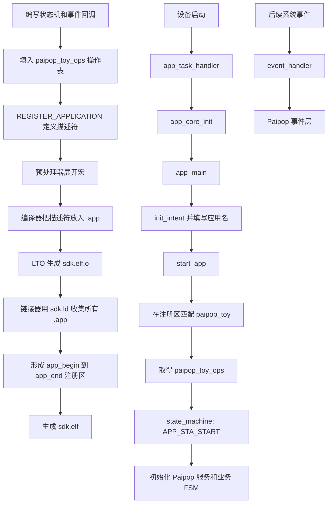

# 杰理 AC79 应用启动与注册机制详解：从 `REGISTER_APPLICATION` 到 `start_app`

第一次看到杰理 SDK 的应用代码时，很容易产生一个疑问：代码里没有常见的 `register_app(&app)`，系统为什么仍然知道有哪些应用，又是怎样找到指定应用并调用状态机的？

答案是：杰理这里使用的不是“运行时调用注册函数”，而是一套基于**宏、特殊段和链接器边界符号**的静态注册机制。

以 Paipop 玩具工程为例，完整链路可以先记成下面这句话：

> 先写状态机回调和事件回调，把它们放进操作表；再用 `REGISTER_APPLICATION` 定义应用描述符。编译器把描述符放进 `.app` 输入段，链接器把所有 `.app` 收集到 `app_begin` 与 `app_end` 之间；系统初始化 `app_core` 后，`app_main()` 用应用名调用 `start_app()`，框架找到描述符，再通过操作表回调状态机和事件处理函数。

把构建期和运行期分开后，整个过程会更清楚：

```text
编写源码
  → 定义状态机回调和事件回调
  → 定义 application_operation 操作表
  → REGISTER_APPLICATION 定义 application 描述符

构建固件
  → 预处理器展开宏
  → 编译器把描述符放入 .app 输入段
  → LTO 跨文件优化并产生 sdk.elf.o
  → 链接脚本收集所有 .app
  → 形成 [app_begin, app_end) 应用注册表
  → 输出 sdk.elf

固件运行
  → app_task_handler 完成各级初始化
  → app_core_init()
  → app_main()
  → init_intent(&it)
  → it.name = "paipop_toy"
  → start_app(&it)
  → 按名称找到 application
  → 通过 ops 调用状态机和事件回调
```

> 本文基于 AC79NN SDK V1.2.5 中的 Paipop 玩具工程整理。`start_app()` 的公开声明可以看到，但实现位于杰理预编译库中，因此本文会把“源码直接确认”和“由符号证据推断”的部分明确区分，避免把推断写成官方源码。

## 代码归属说明

为了避免把业务代码和平台框架混在一起，先明确归属：

| 代码 | 归属 | 在启动链路中的作用 |
|---|---|---|
| `apps/Paipop_YP_Toy/app_main.c` 中的两个回调、操作表、应用描述符和 `app_main()` | Paipop 第一方代码 | 决定这个玩具应用叫什么、启动后做什么、事件怎样进入业务层 |
| `include_lib/system/app_core.h` 中的结构体、状态枚举、注册宏和接口声明 | 杰理 SDK | 规定应用接入框架时必须遵守的接口契约 |
| `apps/common/system/init.c`、`cpu/wl82/sdk_ld.c` 及生成的 `sdk.ld` | 杰理 SDK 公共框架 | 完成系统初始化、链接期收集和应用核心启动 |
| `cpu/wl82/liba/system.a(app_core.c.o)` | 杰理预编译库 | 提供 `app_core_init()`、`start_app()` 等运行时实现 |

因此，**注册机制是杰理提供的，注册进去的 Paipop 应用描述和回调实现是第一方代码**。`PaipopSDK` 的语音、网络和业务能力是在 Paipop 回调被框架触发之后才开始工作，不负责创建杰理的 `.app` 注册机制。

## 一、先认识注册系统中的三个对象

杰理应用注册的核心不是一个对象，而是三层对象：

```text
回调函数
  ↓ 函数地址
操作表 struct application_operation
  ↓ ops 指针
应用描述符 struct application
  ↓ 被放进 .app 段
全局应用注册表 [app_begin, app_end)
```

### 1. 回调函数：应用真正执行的代码

Paipop 工程在 `apps/Paipop_YP_Toy/app_main.c` 中定义了两个回调：

```c
static int paipop_toy_state_machine(struct application *app,
                                    enum app_state state,
                                    struct intent *it)
{
    switch (state) {
    case APP_STA_START:
        paipop_eye_service_init();
        paipop_fsm_init();
        paipop_ota_init();
        key_event_enable();
        paipop_events_start();
        paipop_shake_start(paipop_events_shake_cb, NULL);
        paipop_wifi_provision_start();
        paipop_fsm_dispatch(PAIPOP_EVT_APP_START, 0);
        break;

    case APP_STA_STOP:
    case APP_STA_DESTROY:
        paipop_ota_deinit();
        paipop_wifi_provision_stop();
        paipop_shake_stop();
        paipop_events_stop();
        key_event_disable();
        paipop_fsm_deinit();
        paipop_eye_service_deinit();
        break;

    default:
        break;
    }

    return 0;
}

static int paipop_toy_event_handler(struct application *app,
                                    struct sys_event *event)
{
    if (!event) {
        return false;
    }

    return paipop_events_handle_sys_event(event);
}
```

为了突出启动关系，上面的状态机代码省略了实际工程中的条件编译和日志，但函数职责没有改变：

- `paipop_toy_state_machine()` 接收应用生命周期状态，负责启动或释放业务模块；
- `paipop_toy_event_handler()` 接收按键、设备、网络等系统事件，再转交给 Paipop 的事件层。

这里的 `static` 表示函数只在当前 C 翻译单元中可见，不表示函数只在当前时刻有效。只要函数地址被操作表保存，框架之后仍然可以通过函数指针调用它。

### 2. 操作表：告诉框架应该回调谁

杰理在 `include_lib/system/app_core.h` 中定义了操作表：

```c
struct application_operation {
    int (*state_machine)(struct application *,
                         enum app_state,
                         struct intent *);
    int (*event_handler)(struct application *,
                         struct sys_event *);
};
```

这两个成员都是函数指针。Paipop 工程把刚才的两个回调地址填进去：

```c
static const struct application_operation paipop_toy_ops = {
    .state_machine = paipop_toy_state_machine,
    .event_handler = paipop_toy_event_handler,
};
```

因此，`paipop_toy_ops` 可以理解为应用交给框架的一张“能力表”：

| 成员 | 框架在什么时候使用 | Paipop 实现 |
|---|---|---|
| `state_machine` | 应用创建、启动、暂停、恢复、停止、销毁时 | `paipop_toy_state_machine` |
| `event_handler` | 应用运行期间收到系统事件时 | `paipop_toy_event_handler` |

框架不需要知道 Paipop 内部有哪些 Wi-Fi、眼睛、OTA 或语音模块，只要按约定调用这两个入口即可。这是典型的“面向接口编程”：杰理定义接口，业务应用提供实现。

### 3. 应用描述符：应用的身份证和运行时状态

杰理应用本体的结构定义如下：

```c
struct application {
    u8 state;
    int action;
    char *data;
    const char *name;
    struct list_head entry;
    void *private_data;
    const struct application_operation *ops;
};
```

其中最关键的成员是：

- `name`：应用名称，`start_app()` 用它选择应用；
- `ops`：指向操作表，框架通过它调用状态机和事件处理函数；
- `state`：记录应用当前生命周期状态；
- `action`、`data`、`private_data`、`entry`：供应用切换、参数、私有上下文和链表管理等机制使用。

Paipop 的应用描述符是：

```c
REGISTER_APPLICATION(paipop_toy) = {
    .name = "paipop_toy",
    .ops = &paipop_toy_ops,
    .state = APP_STA_DESTROY,
};
```

这段代码把名称、操作表和初始状态绑在一起。到这里，“应用是谁”和“应用应该执行哪些回调”就完成了绑定。

## 二、`REGISTER_APPLICATION` 到底做了什么

### 1. 第一层宏展开

`app_core.h` 中的定义是：

```c
#define REGISTER_APPLICATION(at) \
    static struct application at SEC_USED(.app)
```

源码写的是：

```c
REGISTER_APPLICATION(paipop_toy) = {
    .name = "paipop_toy",
    .ops = &paipop_toy_ops,
    .state = APP_STA_DESTROY,
};
```

预处理器会把形参 `at` 替换成实参 `paipop_toy`，得到：

```c
static struct application paipop_toy SEC_USED(.app) = {
    .name = "paipop_toy",
    .ops = &paipop_toy_ops,
    .state = APP_STA_DESTROY,
};
```

这里要区分两个名字：

- `paipop_toy` 是 C 变量标识符，由宏参数 `at` 生成；
- `"paipop_toy"` 是运行时用于查找应用的字符串。

它们可以写成相同内容，方便阅读，但机制上不是同一个东西。真正参与运行时名称匹配的是 `.name` 指向的字符串，而不是 C 变量名。

### 2. 第二层宏展开

`include_lib/system/generic/typedef.h` 中还有一层：

```c
#define SEC_USED(x) __attribute__((section(#x), used))
```

因此：

```c
SEC_USED(.app)
```

会继续展开为：

```c
__attribute__((section(".app"), used))
```

最终效果等价于：

```c
static struct application paipop_toy
    __attribute__((section(".app"), used)) = {
        .name = "paipop_toy",
        .ops = &paipop_toy_ops,
        .state = APP_STA_DESTROY,
    };
```

这里有两个 GCC/Clang 属性：

- `section(".app")`：不要按普通全局变量规则放置，而是把这个对象放进名为 `.app` 的输入段；
- `used`：即使编译器看不到普通 C 代码直接引用这个变量，也要保留它。

`#x` 中的 `#` 是预处理器的“字符串化”操作，所以 `.app` 被转成字符串 `".app"`。它不是运行时做字符串转换。

### 3. 这两步是不是程序自己完成的

答案要分阶段说：

| 动作 | 谁完成 | 发生时间 |
|---|---|---|
| 把 `at` 替换成 `paipop_toy` | C 预处理器 | 构建期 |
| 展开 `SEC_USED(.app)` | C 预处理器 | 构建期 |
| 把对象放进 `.app` 输入段 | 编译器 | 构建期 |
| 收集所有 `.app` | 链接器 | 构建期 |
| 调用 `start_app()`、匹配名称、执行回调 | MCU 上运行的程序 | 运行期 |

所以，宏展开和段收集确实是构建工具自动完成的，但不是设备启动后“程序自己替换宏”。固件里已经没有 `REGISTER_APPLICATION` 这个宏了，只有编译后的数据、地址和机器指令。

## 三、代码明明在其他段，`.app` 段里到底有什么

一个应用相关的内容不会全部进入 `.app`。概念上可以这样理解：

```text
.text
  paipop_toy_state_machine() 的机器指令
  paipop_toy_event_handler() 的机器指令

.rodata 或工具链的只读常量段
  "paipop_toy" 字符串
  paipop_toy_ops 操作表（通常位于只读区域）

.app
  struct application paipop_toy 描述符
  ├── state
  ├── name ────────────────> "paipop_toy"
  └── ops  ────────────────> paipop_toy_ops
                                ├── state_machine ──> 回调函数代码
                                └── event_handler ──> 回调函数代码
```

`.app` 段存放的不是应用全部代码，而是应用描述符。描述符像一张索引卡，里面的指针把框架引向名称、操作表和最终回调代码。

这也是静态注册系统常用的设计：

- 业务代码仍放在正常代码段；
- 注册信息集中放在一个特殊段；
- 运行时遍历小而规则的描述符数组；
- 增加新应用时不必手工修改一张中央注册表。

## 四、`.rela.app` 是什么，为什么名字里有两个点

在本次构建保存的 LTO 中间目标文件 `sdk.elf.o` 中，可以看到：

```text
Idx Name       Size
64  .app       00000020
65  .rela.app  00000018
```

`.app` 中的描述符包含指针：

```c
.name = "paipop_toy",
.ops = &paipop_toy_ops,
```

目标文件刚产生时，字符串和操作表的最终地址还没有确定。编译器不能直接填入最终绝对地址，只能先留下“这里以后要修正”的记录。这样的记录就是**重定位项**。

`.rela.app` 可以拆成：

```text
.rela + .app
  │      └── 它服务的目标段
  └── relocation with addend，带加数的重定位记录
```

因此，`.rela.app` 的意思是“用于修正 `.app` 内容的重定位表”。链接器确定地址后，会根据这些记录把正确地址填回应用描述符。

名字里的两个点不是 C 语言的运算符，也不是“两个段连接起来”的语法。ELF 段名本来就经常用点号表示层次，例如：

```text
.text.startup
.rodata.str1.4
.rela.app
```

还要特别注意：

> `.rela.app` 是给链接器使用的元数据，不是杰理应用注册表，也不是运行时需要遍历的应用列表。

最终链接后，相关地址已经被修正。这些重定位元数据是否继续保留在最终 ELF 中取决于链接方式，但它通常不属于需要烧进 MCU 的运行时应用内容。

## 五、链接脚本怎样把所有应用组成注册表

### 1. `app_begin`、`*(.app)` 和 `app_end`

`cpu/wl82/sdk.ld` 中有下面的链接规则：

```text
_app_begin = .;
PROVIDE(app_begin = .);
*(.app)
_app_end = .;
PROVIDE(app_end = .);
```

这里的 `.` 是链接器的**位置计数器**，表示当前输出地址。

这几行代码按顺序完成：

1. 在收集应用前，把当前位置记录为 `app_begin`；
2. `*(.app)` 收集所有输入目标文件中的 `.app` 段；
3. 收集结束后，把新的当前位置记录为 `app_end`。

最终形成一个左闭右开的内存范围：

```text
[app_begin, app_end)

app_begin
    ↓
┌──────────────────────────────┐
│ application A               │
├──────────────────────────────┤
│ application B               │
├──────────────────────────────┤
│ application C               │
└──────────────────────────────┘
                               ↑
                            app_end
```

`app_end` 指向最后一个描述符之后，而不是最后一个描述符本身。这种 `[begin, end)` 形式与 C/C++ 数组遍历习惯一致。

所以，“将所有 app 链接到 `app_begin` 地址后面”这个说法大体正确，但更准确的表达是：

> 链接器先在当前位置定义 `app_begin`，再把所有输入 `.app` 段依次收集进来，最后定义 `app_end`。

### 2. 本次构建的 Map 证据

本次 Paipop 固件的 `sdk.map` 中可以看到：

```text
0x04007bac  _app_begin = .
0x04007bac  PROVIDE (app_begin, .)
            *(.app)
0x04007bac  .app  size 0x20  sdk.elf.o
0x04007bcc  _app_end = .
0x04007bcc  PROVIDE (app_end, .)
```

这说明当前构建的应用注册区：

```text
起始地址：0x04007bac
结束地址：0x04007bcc
长度：    0x20，也就是 32 字节
```

当前构建中只有一个 Paipop 应用描述符，因此 `.app` 只有一个 `struct application` 的空间。地址和大小只是这一次构建的结果，换 SDK 配置、工具链或应用数量后都可能变化，不能写死在业务代码中。

### 3. 链接脚本是不是 SDK 自带的

机制来自杰理 SDK，但当前使用的 `sdk.ld` 不是一份完全固定、永不变化的手写产物。

Paipop 的 `board/wl82/Makefile` 会执行类似命令：

```make
$(CC) $(CFLAGS) $(DEFINES) $(INCLUDES) \
    -D__LD__ -E -P ../../../../cpu/wl82/sdk_ld.c \
    -o ../../../../cpu/wl82/sdk.ld
```

也就是说：

```text
杰理提供 sdk_ld.c 链接脚本模板
        ↓ 预处理，带入当前宏配置
生成当前构建使用的 sdk.ld
        ↓
链接器通过 -T sdk.ld 完成最终布局
```

所以更准确的说法是：**杰理 SDK 提供链接脚本模板和生成规则，构建系统根据当前配置生成 `sdk.ld`，再用它链接。**

## 六、LTO、`sdk.elf.o` 和 `sdk.elf` 分别是什么

### 1. 没有 LTO 时

普通构建大致是：

```text
app_main.c → app_main.o ┐
wifi.c     → wifi.o     ├→ 链接器 → sdk.elf
fsm.c      → fsm.o      ┘
```

编译器通常以单个 C 文件为单位优化。它看不到其他目标文件的完整内部实现，跨文件内联和全局删除能力有限。

### 2. 开启 LTO 后

Paipop 工程使用 `-flto`，Windows 构建还会调用 `pi32v2-lto-wrapper.exe`。LTO 是 **Link Time Optimization，链接时优化**。

构建过程更接近：

```text
多个源文件
  → 产生带中间表示的目标文件
  → LTO 在链接阶段统一查看多个翻译单元
  → 跨文件内联、常量传播、删除无用代码
  → 生成合并后的机器码目标文件
  → 按链接脚本生成最终 ELF
```

### 3. `sdk.elf.o`

Makefile 中启用了：

```make
--plugin-opt=save-temps
```

因此 LTO 会保存中间产物。`sdk.elf.o` 就是其中一个可重定位目标文件：

- 它已经包含 LTO 处理后的合并结果；
- 它仍然有输入段和重定位信息；
- 所以其中可以同时看到 `.app` 与 `.rela.app`；
- 它不是源代码，也不是最终可下载固件。

### 4. `sdk.elf`

`sdk.elf` 是链接器按 `sdk.ld` 分配完最终地址后得到的 ELF：

- 包含最终段地址和符号；
- 可用于反汇编、调试和生成 Map；
- 后续还会由杰理工具提取、打包成实际烧录或升级产物。

可以简单记忆：

```text
sdk.elf.o：LTO 保存下来的“还可以继续链接”的中间目标文件
sdk.elf：  地址已经布局完成的最终 ELF
```

## 七、运行时从哪里开始进入 Paipop 应用

构建期已经把注册表准备好，设备运行时才会真正使用它。

### 1. `app_task_handler()` 完成系统初始化

杰理公共代码 `apps/common/system/init.c` 中，`app_task_handler()` 的关键顺序是：

```c
sys_timer_init();
sys_timer_task_init();

board_early_init();
__do_initcall(early_initcall);
__do_initcall(platform_initcall);
board_init();

__do_initcall(initcall);
__do_initcall(module_initcall);
app_core_init();
__do_initcall(late_initcall);
app_main();

while (1) {
    res = os_task_pend("taskq", msg, ARRAY_SIZE(msg));
    if (res == OS_TASKQ) {
        app_core_msg_handler(msg);
    }
}
```

这段流程可以分成三层：

```text
平台层：定时器、早期板级、platform init、board init
系统层：initcall、module initcall、app_core_init、late initcall
应用层：app_main，之后进入 app_core 消息循环
```

这里必须注意顺序：`app_core_init()` 在 `app_main()` 之前调用。也就是说，Paipop 请求启动应用前，杰理应用核心已经完成初始化。

### 2. `app_main()` 发出“启动哪个应用”的请求

Paipop 的入口是：

```c
void app_main(void)
{
    struct intent it;

    puts("------------- Paipop YP Toy app -------------\n");
    init_intent(&it);
    it.name = "paipop_toy";
    start_app(&it);
}
```

`struct intent` 可以理解为一次应用启动请求：

```c
struct intent {
    const char *name;
    int action;
    const char *data;
    u32 exdata;
};
```

其中：

- `name` 指定目标应用；
- `action` 可表示进一步动作；
- `data` 和 `exdata` 可携带附加参数。

Paipop 这里只指定名称，因此语义就是：“请启动名为 `paipop_toy` 的应用。”

## 八、`init_intent(&it)` 是宏，只能填 `it` 吗

宏定义是：

```c
#define init_intent(it) \
    do { \
        (it)->name = NULL; \
        (it)->action = 0; \
        (it)->data = NULL; \
        (it)->exdata = 0; \
    } while (0)
```

这里的 `it` 只是宏形参名，不要求调用者也必须把变量命名为 `it`。下面都可以：

```c
struct intent request;
init_intent(&request);

struct intent *p = &request;
init_intent(p);
```

宏展开后分别等价于：

```c
(&request)->name = NULL;
p->name = NULL;
```

真正要求是：传入表达式必须能作为一个可写的 `struct intent *` 使用。下面这样不行：

```c
struct intent request;
init_intent(request);  // 错误：request 是结构体对象，不是指针
```

还应避免传入带副作用的表达式：

```c
init_intent(get_next_intent());
```

因为宏参数在宏体中出现了四次，函数可能被调用四次。普通变量地址或稳定指针最安全。

### 为什么使用 `do { } while (0)`

这是 C 多语句宏的常见写法，目的是让整个宏在语法上像一条语句：

```c
if (need_init)
    init_intent(&request);
else
    handle_error();
```

如果宏只是裸露的四条赋值语句，放进 `if/else` 后容易产生控制流错误。`do { } while (0)` 不是真的为了循环，执行一次就结束。

这里同样要区分两个时间：

- `init_intent` 的文本展开发生在构建期；
- 展开得到的四条赋值指令在 MCU 运行到这里时执行。

## 九、`start_app()` 怎样找到应用

### 1. 源码能直接确认什么

我们能从公开头文件和链接结果直接确认：

- `start_app(struct intent *it)` 是杰理 `app_core` 提供的接口；
- 链接脚本提供 `app_begin` 与 `app_end`；
- Paipop 描述符位于两者之间；
- 启动请求的 `it.name` 是 `"paipop_toy"`；
- 描述符的 `.name` 也是 `"paipop_toy"`；
- 描述符的 `.ops` 指向 `paipop_toy_ops`。

### 2. 预编译库还能提供什么证据

`start_app()` 的 C 实现不在开放源码中，而在杰理预编译的 `system.a(app_core.c.o)` 中。符号表显示这个目标模块：

```text
t __start_app
U app_begin
W app_core_init
U app_end
T start_app
U strcmp
```

其中：

- `T start_app`：这个模块定义了全局 `start_app`；
- `t __start_app`：还有一个模块内部使用的启动实现；
- `U app_begin`、`U app_end`：它会使用应用注册区边界；
- `U strcmp`：它会进行字符串比较。

这些证据强烈支持“遍历 `[app_begin, app_end)`，按名称比较并选择应用”的判断。

下面只能写成**等价伪代码**，不能冒充杰理官方源码：

```c
static struct application *match_application(const char *name)
{
    for (struct application *app = app_begin;
         app < app_end;
         app++) {
        if (strcmp(app->name, name) == 0) {
            return app;
        }
    }

    return NULL;
}
```

随后框架会通过应用描述符中的操作表驱动生命周期，概念上类似：

```c
app->ops->state_machine(app, APP_STA_START, it);
```

由于真实实现位于预编译库中，仅凭符号表不能断言它内部每一条分支，也不能武断地写出 `CREATE`、`START` 等状态的全部精确切换顺序。可以确认的是：启动 Paipop 最终会进入 `APP_STA_START` 分支，否则玩具业务模块不会完成初始化。

## 十、操作表、状态机和事件回调怎样配合

### 1. 杰理应用生命周期状态机

`enum app_state` 定义了六种状态：

```c
enum app_state {
    APP_STA_CREATE,
    APP_STA_START,
    APP_STA_PAUSE,
    APP_STA_RESUME,
    APP_STA_STOP,
    APP_STA_DESTROY,
};
```

FSM 是 **Finite State Machine，有限状态机**。它把系统抽象成有限个状态，以及状态之间允许发生的变化。

Paipop 的应用生命周期状态机由杰理 `app_core` 驱动：

```text
app_core 决定当前生命周期状态
        ↓ 间接函数调用
paipop_toy_ops.state_machine(..., state, ...)
        ↓ switch(state)
执行 APP_STA_START、STOP、DESTROY 等分支
```

在 `APP_STA_START` 中，Paipop 初始化自己的服务并派发业务启动事件；在 `APP_STA_STOP` 或 `APP_STA_DESTROY` 中，再按相反方向停止服务、释放资源。

### 2. 系统事件回调

生命周期状态变化和日常系统事件不是一回事。

当按键、设备、网络等系统事件到来时，`app_core` 通过另一张函数指针调用：

```text
杰理系统事件
  → app_core
  → paipop_toy_ops.event_handler
  → paipop_toy_event_handler
  → paipop_events_handle_sys_event
  → Paipop 业务事件处理
```

因此操作表的两个入口分工很清楚：

```text
state_machine：处理“应用处于哪个生命周期阶段”
event_handler：处理“应用运行时收到了什么系统事件”
```

### 3. 项目里其实有两层 FSM

Paipop 工程中还调用了：

```c
paipop_fsm_init();
paipop_fsm_dispatch(PAIPOP_EVT_APP_START, 0);
```

这说明项目中至少有两层状态机：

| 层次 | 所属 | 负责内容 |
|---|---|---|
| 应用生命周期 FSM | 杰理 `app_core` | 应用创建、启动、暂停、恢复、停止、销毁 |
| 产品业务 FSM | Paipop | 配网、空闲、唤醒、对话、播放等具体业务状态 |

两者不是同一个状态机。杰理 FSM 决定“整个 Paipop 应用是否正在运行”，Paipop FSM 决定“正在运行的玩具当前处于哪个业务阶段”。

它们的连接点就在 `APP_STA_START` 分支：杰理启动应用后，Paipop 初始化自己的业务 FSM，并向它派发 `PAIPOP_EVT_APP_START`。

## 十一、把整个流程画成一张图



图的上半部分是构建期，下半部分是运行期。注册表在构建时形成，设备运行时只是读取和使用它，不会重新创建 `.app` 段。

## 十二、哪些步骤是自动的，哪些必须自己写

| 步骤 | 开发者编写 | 工具或框架自动完成 |
|---|---:|---:|
| 实现状态机回调 | 是 | 否 |
| 实现事件回调 | 是 | 否 |
| 填写 `application_operation` | 是 | 否 |
| 写 `REGISTER_APPLICATION(...)` | 是 | 否 |
| 宏形参替换和字符串化 | 否 | 预处理器完成 |
| 生成 `.app` 输入段 | 否 | 编译器完成 |
| 产生 `.rela.app` | 否 | 编译器/LTO 按需完成 |
| 收集所有 `.app` | 否 | 链接器按 `sdk.ld` 完成 |
| 形成 `app_begin/app_end` | 否 | 链接器完成 |
| 在 `app_main()` 填写目标应用名 | 是 | 否 |
| 匹配应用并调度回调 | 否 | 杰理 `app_core` 完成 |
| Paipop 业务模块初始化 | 回调内容由开发者编写 | 框架触发回调 |

## 十三、几个容易讲错的地方

### 1. “调用宏注册应用”

不够准确。宏不是运行时函数，没有“调用”行为。更准确的说法是：

> 使用 `REGISTER_APPLICATION` 宏定义一个应用描述符，并要求编译器把它放入 `.app` 段。

### 2. “应用代码都被放进 `.app`”

错误。`.app` 主要是 `struct application` 描述符；回调函数机器码仍在代码段，操作表和字符串通常在只读数据区。

### 3. “`used` 保证一定能链接进最终固件”

不完整。`used` 主要防止编译器删除对象；还需要链接脚本通过 `*(.app)` 收集这个段。编译器保留和链接器收集缺一不可。

### 4. “`.rela.app` 是第二张应用表”

错误。它是 `.app` 的重定位元数据，用来告诉链接器哪些地址需要修正。

### 5. “`app_begin` 是第一个 app 变量”

不完全准确。`app_begin` 是链接器定义的边界符号，数值等于注册区起始地址；它本身不是由某个 C 文件定义的普通 `struct application` 对象。

### 6. “`start_app()` 直接写死调用 Paipop 函数”

错误。框架面向 `struct application` 和操作表工作。Paipop 只是注册表中的一个条目，真正的业务函数通过函数指针间接调用。

### 7. “杰理应用状态机就是 Paipop 业务状态机”

错误。前者管理应用生命周期，后者管理玩具业务状态；Paipop 在杰理应用启动回调中启动自己的业务 FSM。

## 十四、这套注册机制还能用在哪里

杰理 SDK 中不只有应用使用这种思路。设备、系统事件处理器、初始化函数等机制也常见类似形式：

```text
定义对象或函数
  → 宏附加 section 属性
  → 放入 .device、.sys_event.*、.late.initcall 等特殊段
  → 链接脚本生成 begin/end 边界
  → 框架在运行时遍历或按优先级调用
```

常见例子包括：

- `REGISTER_DEVICES`：注册设备描述符；
- `SYS_EVENT_STATIC_HANDLER_REGISTER`：注册静态系统事件处理器；
- `late_initcall`：注册较晚阶段执行的初始化函数。

它们的业务含义不同，但底层套路高度相似。理解 `.app` 后，再看这些宏就不应只停留在“这是 SDK 魔法”，而可以继续追踪：

1. 宏最终定义了什么对象；
2. 对象被放进什么段；
3. 链接脚本在哪里收集该段；
4. 谁使用 begin/end 边界；
5. 最终通过直接调用还是函数指针回调业务代码。

## 十五、怎样用一分钟给别人讲清楚

可以直接按下面这段话讲：

> 杰理的应用注册是一种“链接期静态注册”。我先实现应用生命周期状态机和系统事件回调，再把两个函数指针放入 `application_operation` 操作表。然后用 `REGISTER_APPLICATION` 定义 `struct application` 描述符，把应用名、初始状态和操作表绑定起来。这个宏在预处理阶段展开，编译器通过 section 属性把描述符放进 `.app` 输入段。链接时，SDK 生成的 `sdk.ld` 用 `*(.app)` 收集所有应用，并用 `app_begin`、`app_end` 标出注册表范围。设备运行后，公共初始化代码先调用 `app_core_init()`，再进入我的 `app_main()`；我初始化 `intent`、填入 `paipop_toy` 并调用 `start_app()`。`app_core` 在注册区按名称找到应用，再通过 `ops` 间接调用状态机。状态进入 `APP_STA_START` 后，我的代码才开始初始化 Wi-Fi、事件、OTA 和 Paipop 业务 FSM。后续系统事件则走 `event_handler`。所以宏和段是在构建期完成注册，名称匹配和回调调度是在运行期完成。

如果对方继续追问 `.rela.app`、LTO 或 `sdk.elf.o`，再补充：

> `.app` 里的名称和操作表都是指针，目标文件产生时最终地址还没确定，所以 `.rela.app` 保存修正这些指针的重定位记录。工程开启了 LTO，`sdk.elf.o` 是 `save-temps` 留下的 LTO 中间目标文件，`sdk.elf` 才是按链接脚本完成最终地址布局的 ELF。

## 十六、源码证据索引

本文关键结论来自以下位置：

| 证据 | 位置 | 能确认的内容 |
|---|---|---|
| Paipop 回调、操作表、注册描述符和 `app_main()` | `apps/Paipop_YP_Toy/app_main.c` | 第一方应用如何接入杰理框架 |
| `enum app_state`、`intent`、操作表、应用结构和注册宏 | `include_lib/system/app_core.h` | 杰理应用接口契约 |
| `SEC_USED` | `include_lib/system/generic/typedef.h` | 特殊段与 `used` 属性 |
| 公共启动顺序 | `apps/common/system/init.c` | `app_core_init()` 与 `app_main()` 的调用先后 |
| 应用段收集规则 | `cpu/wl82/sdk_ld.c` 生成的 `cpu/wl82/sdk.ld` | `app_begin`、`*(.app)`、`app_end` |
| LTO、`save-temps` 和 `sdk.ld` 生成命令 | `apps/Paipop_YP_Toy/board/wl82/Makefile` | 构建链路 |
| 应用段的最终地址和长度 | `cpu/wl82/tools/sdk.map` | 当前构建的实际链接布局 |
| `.app` 与 `.rela.app` | `cpu/wl82/tools/sdk.elf.o` | LTO 中间目标文件的段结构 |
| `start_app` 对边界符号和 `strcmp` 的引用 | `cpu/wl82/liba/system.a(app_core.c.o)` 符号表 | 名称扫描机制的强证据，但不是完整源码 |

## 总结

杰理应用启动可以分成三个阶段：

```text
源码设计阶段
  回调函数 → 操作表 → 应用描述符

构建阶段
  宏展开 → .app/.rela.app → LTO → 链接脚本收集 → app_begin/app_end

运行阶段
  app_core_init → app_main → intent → start_app → 名称匹配 → ops 回调
```

最值得掌握的不是某一个宏的写法，而是背后的通用方法：

> 用特殊段自动汇集分散在不同源文件中的描述符，再用链接器生成边界，最后由运行时框架遍历描述符并通过函数指针回调业务代码。

一旦把预处理、编译、LTO、链接和运行这几个时间点分开，`REGISTER_APPLICATION`、`.app`、`.rela.app`、`sdk.elf.o`、`app_begin` 和 `start_app()` 就不再是互相割裂的名词，而是一条连续的启动链路。
